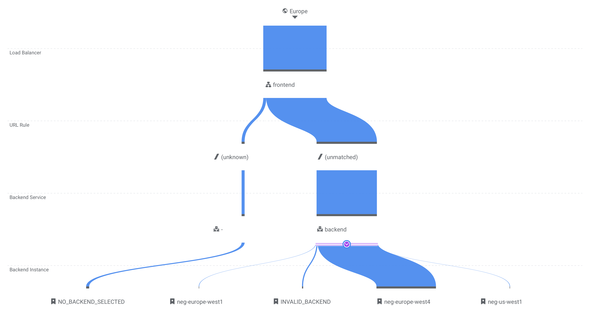

# A minimal setup for a high-availability service using Google Cloud Run

In this blog post, I will explain what is needed to set up a web service that runs in multiple GCP regions.
The main reasons to deploy your service in more than one region are:

* Handle single-region failures so that your application is highly available.
* Route traffic to the nearest region so your users experience faster loading times.

## Create Cloud Run deployments

A Cloud Run service only lives in a single region, so for a multi-region setup we will need to deploy the same container in multiple regions.
Luckily using a Terraform `for_each` loop, this does not add too much additional configuration:

```hcl
locals {
  locations = ["europe-west4", "europe-west1"]
}

resource "google_cloud_run_service" "service" {
  for_each = toset(local.locations)

  name     = "service-${each.key}"
  location = each.key

  ...
}
```

I recommend to use the name of the region in the name of the Cloud Run service so you can easily find them and guarantee uniqueness.

> We use `local.locations` to define the regions we want to deploy in so we can re-use that configuration in other resources.

## Set up load balancing ingress

By default, Cloud Run gives a service a publicly available `.run.app` URL.
However this points to a single Cloud Run service, and for a multi-region set we will need multiple services.
To do this, we will need to create a Global Load Balancer that uses [Serverless Network Endpoint Groups](https://cloud.google.com/load-balancing/docs/negs/serverless-neg-concepts) (NEGs) as backend.
These NEGs then route the traffic to the Cloud Run instances.

Let's set up the needed resource for our ingress stack:

```hcl
resource "google_compute_global_address" "ip" {
  name = "service-ip"
}

resource "google_compute_region_network_endpoint_group" "neg" {
  for_each = toset(local.locations)

  name                  = "neg-${each.key}"
  network_endpoint_type = "SERVERLESS"
  region                = each.key

  cloud_run {
    service = google_cloud_run_service.service[each.key].name
  }
}

resource "google_compute_backend_service" "backend" {
  name     = "backend"
  protocol = "HTTP"

  dynamic "backend" {
    for_each = toset(local.locations)

    content {
      group = google_compute_region_network_endpoint_group.neg[backend.key].id
    }
  }
}

resource "google_compute_url_map" "url_map" {
  name            = "url-map"
  default_service = google_compute_backend_service.backend.id
}

resource "google_compute_target_http_proxy" "http_proxy" {
  name    = "http-proxy"
  url_map = google_compute_url_map.url_map.id
}

resource "google_compute_global_forwarding_rule" "frontend" {
  name       = "frontend"
  target     = google_compute_target_http_proxy.http_proxy.id
  port_range = "80"
  ip_address = google_compute_global_address.ip.address
}
```

> Notice how we are re-using `local.locations` to create the regional resources.

No one can call our service yet though, because we need to tell GCP that this is a public service that can be invoked by everyone:

```hcl
data "google_iam_policy" "noauth" {
  binding {
    role    = "roles/run.invoker"
    members = ["allUsers"]
  }
}

resource "google_cloud_run_service_iam_policy" "noauth" {
  for_each = toset(local.locations)

  service     = google_cloud_run_service.service[each.key].name
  location    = google_cloud_run_service.service[each.key].location
  policy_data = data.google_iam_policy.noauth.policy_data
}
```

## Deploy and call the service

Let's add an output for the static IP address so we know what to call after deployment:

```hcl
output "static_ip" {
  value = google_compute_global_address.ip.address
}
```

Now run `terraform apply` to deploy everything and validate that it returns the "Hello World" container (for example using `curl $(terraform output --raw static_ip)`).

The Google Cloud Console also gives a nice visual overview of how the requests are routed:



Now you know how to deploy Google Cloud Run services in multiple regions. Give it a try with [PrivateBin](https://binx.io/blog/2021/09/12/how-to-deploy-privatebin-on-google-cloud-run-and-google-cloud-storage/)!

## Bonus: enable Cloud CDN for even faster loading times

To prevent static assets from being served from your container, you can enable Cloud CDN to automatically serve these from Cloud Storage edge locations instead of the container itself.
Cloud CDN will automatically detect which routes are static resources, but you can manually override this configuration as well.

Simply add the `enable_cnd` flag to the backend service resource:

```hcl
resource "google_compute_backend_service" "backend" {
  name       = "backend"
  protocol   = "HTTP"
  enable_cdn = true

  ...
}
```
